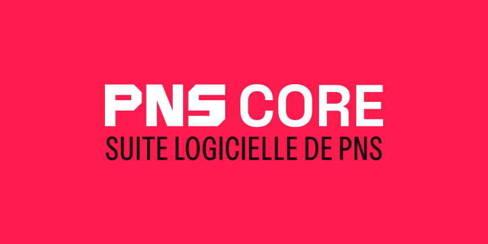

<h1>PNS Core</h1>

Suite logicielle de PNS

Ce monorepo abrite les différents logiciels de PNS, dont :

- 🔌 [backend](./apps/backend/) : une API REST pour tous les logiciels
- 🌐 [website](./apps/website/) : le site web de PNS ([pns.gg ↗️](https://pns.gg))
- 🎫 [erpns](./apps/erpns/) : le logiciel de gestion événementielle : communication, stocks, etc.

ainsi que des paquets internes :

- [@pns/api-client](./packages/api-client/) : export du client typesafe Elysia Treaty du backend

> [!WARNING]
> La documentation est encore très rudimentaire. Des [Pull Requests](https://github.com/pnsgg/core/pulls) sont les bienvenues !
